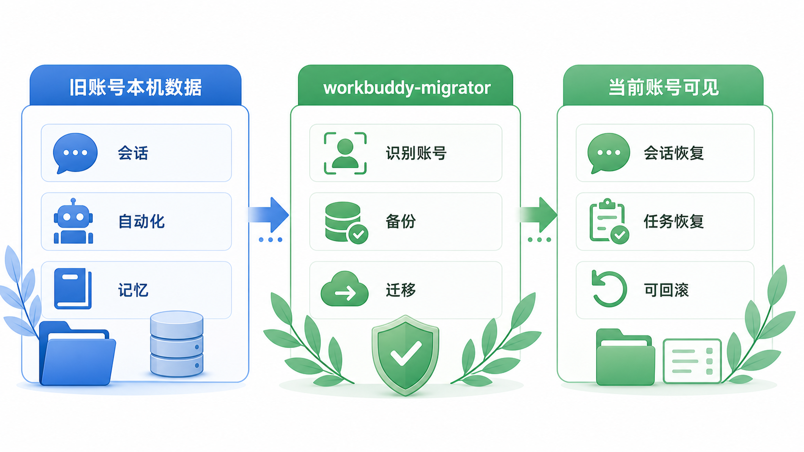
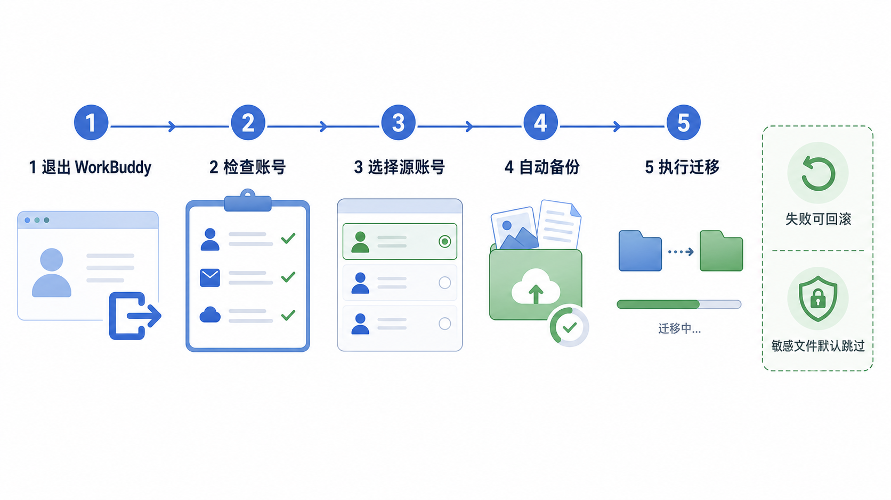
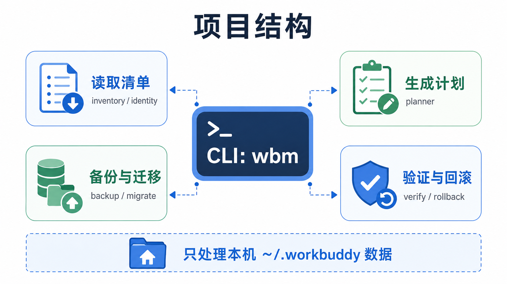

# workbuddy-migrator


`workbuddy-migrator` 是一个本地 WorkBuddy 账号数据迁移工具。它适合在你切换 WorkBuddy 账号后，把旧账号留在本机的数据恢复到当前登录账号下可见。

它只处理本机 `~/.workbuddy` 数据：不会转移云端账号所有权，不会绕过 WorkBuddy 登录，也不会默认复制密钥、token、credentials 这类敏感连接器文件。



## 适合什么场景

适合：

- 旧账号里有本机会话，新账号登录后看不到。
- 旧账号创建过自动化任务，切换账号后需要恢复归属。
- 想把本机记忆文件和非敏感连接器配置合并到新账号。

不适合：

- 把云端服务里的账号、套餐、权限转移给另一个账号。
- 找回密码、绕过登录或同步另一台电脑上的数据。
- 一键复制包含密钥的连接器文件。

## 快速开始

先确认本机已经安装 Python 3.11 或更高版本。这个项目运行时只用 Python 标准库，普通使用不需要创建虚拟环境。

进入项目目录后，可以直接运行：

```bash
cd /path/to/workbuddy-migrator
python3 -m workbuddy_migrator.cli doctor
```

如果想使用更短的 `wbm` 命令，再安装到当前用户环境：

```bash
python3 -m pip install --user .
wbm doctor
```

## 三步迁移



迁移前请完全退出 WorkBuddy。

第一步，检查环境：

```bash
python3 -m workbuddy_migrator.cli doctor
```

第二步，查看本机账号：

```bash
python3 -m workbuddy_migrator.cli inventory --json
```

第三步，启动交互式迁移：

```bash
python3 -m workbuddy_migrator.cli migrate
```

工具会列出账号编号，例如：

```text
[1] curr...user  Example User
    当前登录账号 / 130 会话 / 3 自动化

[2] old-...user  未找到姓名
    6 会话 / 0 自动化
```

一般选择旧账号作为源账号，当前登录账号作为目标账号：

```text
从哪个账号迁出？输入编号: 2
迁移到哪个账号？输入编号: 1
输入 y 开始备份并迁移，其他输入取消: y
```

只有最后输入 `y`，工具才会创建备份并写入数据。

## 迁移后验证

运行：

```bash
python3 -m workbuddy_migrator.cli verify --source <old_user_id> --target current --json
```

然后重新打开 WorkBuddy，检查旧账号的会话和自动化任务是否已经出现在当前账号下。

## 回滚

`migrate` 和 `apply` 命令在写入前都会创建备份。备份保存在：

```bash
~/.workbuddy/migrator-backups
```

如果需要回滚，先退出 WorkBuddy，然后运行：

```bash
python3 -m workbuddy_migrator.cli rollback <backup_id>
```

## 迁移范围

| 数据类型 | 处理方式 |
| --- | --- |
| 会话数据库记录 | 将旧账号 `user_id` 改为目标账号 |
| 自动化任务 | 将 `owner_user_id` 改为目标账号 |
| 记忆文件 | 合并到目标账号文件，并做行级去重 |
| `memery` 文件 | 保留兼容目录并合并 |
| 连接器配置 | 合并非敏感文件，跳过疑似密钥文件 |
| 会话 JSONL 文件 | 只做覆盖率校验，不重写正文 |

## 项目结构



核心模块保持很薄：

- `cli` 负责命令行交互。
- `inventory` 和 `identity` 负责识别本机账号和数据清单。
- `planner` 负责生成迁移计划。
- `backup` 和 `migrate` 负责备份与写入。
- `verify` 和 `rollback` 负责迁移后检查与恢复。

## 常用命令

```bash
# 生成迁移计划，不写入数据
python3 -m workbuddy_migrator.cli plan --source <old_user_id> --target current --report reports/plan.json

# 自动备份并执行，适合脚本使用
python3 -m workbuddy_migrator.cli apply --source <old_user_id> --target current --yes

# 输出 JSON，便于检查或留档
python3 -m workbuddy_migrator.cli inventory --json
python3 -m workbuddy_migrator.cli verify --source <old_user_id> --target current --json
```

## 安全模型

- `doctor`、`inventory`、`plan`、`verify` 都是只读命令。
- `migrate` 使用编号选择账号，并在最终确认前不写入。
- 每次写入前都会创建备份。
- SQLite 写入使用事务，失败会回滚本次写入。
- JWT 中的姓名或昵称只用于帮你识别账号，真实迁移仍然只按 `user_id` 执行。
- 默认跳过密钥、token、credentials 等敏感连接器文件。

## 开发

开发和跑测试时建议使用虚拟环境，避免把 `pytest` 等开发依赖装进全局 Python：

```bash
python -m venv .venv
source .venv/bin/activate
python -m pip install -e ".[dev]"
python -m pytest -q
```

## 许可证

MIT License. 见 [LICENSE](LICENSE)。
